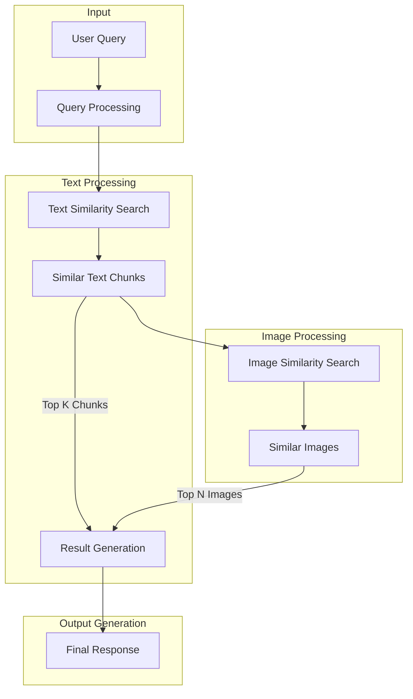
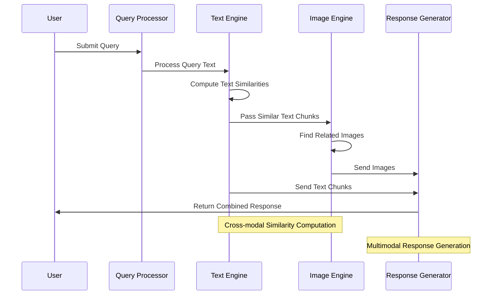

# Multimodal RAG (Retrieval Augmented Generation) System

<div align="center">


</div>

<div align="center">
<p>A sophisticated system for multimodal information retrieval and generation</p>
</div>

---

## 🌟 Overview
This project implements a sophisticated Multimodal Retrieval Augmented Generation (RAG) system that processes both video and text data. The system is designed to analyze video content, extract frames, generate transcripts, and perform semantic search across multiple modalities (text and images).

## 📁 Project Structure
```
.
├── 📓 Multimodal RAG.ipynb    # Main implementation notebook
├── 📝 requirements.txt        # Project dependencies
├── 🖼️ _asserts/              # Visualization outputs and results
├── 🎞️ frames/                # Extracted video frames
├── 🔊 audios/                # Extracted audio files
├── 📜 transcripts/           # Generated transcripts
└── 🎥 decision-making-course.mp4  # Source video file
```

## 🚀 Features

### Core Capabilities
- 🎥 **Intelligent Video Processing**
  - Advanced frame extraction
  - Precise keyframe detection
  - High-quality audio separation

- 🔊 **Audio Processing Excellence**
  - Speech-to-text transcription
  - Noise reduction
  - Audio segmentation

- 🧠 **Advanced Embedding Generation**
  - CLIP-based image embeddings
  - Transformer-based text embeddings
  - Cross-modal embedding alignment

- 🔍 **Smart Search & Retrieval**
  - Semantic similarity matching
  - Multi-modal context understanding
  - Relevance ranking

- 🎯 **Query Processing**
  - Natural language understanding
  - Context-aware processing
  - Multi-modal query interpretation

## 🔄 System Workflow

<div align="center">

### High-Level Architecture


### Detailed Process Flow

</div>

### Step-by-Step Flow:
1. 📝 **Query Input**
   - User submits a natural language query
   - System preprocesses and embeds the query

2. 🔍 **Text Processing**
   - Searches through transcript embeddings
   - Identifies most similar text chunks
   - Ranks text chunks by relevance

3. 🖼️ **Image Processing**
   - Takes similar text chunks as input
   - Searches through frame embeddings
   - Identifies visually relevant frames

4. 🎯 **Response Generation**
   - Combines relevant text and images
   - Ranks multimodal content
   - Generates coherent response

### 1. Video Processing
The system begins by processing the video file using FFmpeg for frame and audio extraction.


*FFmpeg subprocess execution for media processing*

### 2. Text Processing
The system processes transcripts through tokenization and embedding generation.


*Transcript tokenization process*


*Generated text embeddings visualization*

### 3. Image Processing
Frames are processed to generate image embeddings for semantic search.


*Image embedding generation process*

### 4. Cross-modal Similarity
The system computes cosine similarities between different modalities.


*Cosine similarity computation results*

### 5. Query Processing
For a given query, the system:
1. Generates query embeddings
2. Finds relevant text chunks
3. Retrieves similar images


*Query embedding generation*


*Query-content similarity computation*

### 6. Results Visualization
The system provides various visualizations for the retrieved results:


*Top 10 matching text segments*


*Top 3 similar images for the query*


*Final retrieved text results*

## 📊 Performance and Results
The system demonstrates effective cross-modal retrieval capabilities:
- 📈 Accurate text chunk retrieval based on semantic similarity
- 🎯 Relevant image frame extraction matching query context
- 🔄 Cross-modal alignment between text and visual content

Each query returns both relevant text segments and associated visual frames, providing a comprehensive multimodal response.

## 📜 License

MIT License

Copyright (c) 2024 [Your Name]

Permission is hereby granted, free of charge, to any person obtaining a copy
of this software and associated documentation files (the "Software"), to deal
in the Software without restriction, including without limitation the rights
to use, copy, modify, merge, publish, distribute, sublicense, and/or sell
copies of the Software, and to permit persons to whom the Software is
furnished to do so, subject to the following conditions:

The above copyright notice and this permission notice shall be included in all
copies or substantial portions of the Software.

THE SOFTWARE IS PROVIDED "AS IS", WITHOUT WARRANTY OF ANY KIND, EXPRESS OR
IMPLIED, INCLUDING BUT NOT LIMITED TO THE WARRANTIES OF MERCHANTABILITY,
FITNESS FOR A PARTICULAR PURPOSE AND NONINFRINGEMENT. IN NO EVENT SHALL THE
AUTHORS OR COPYRIGHT HOLDERS BE LIABLE FOR ANY CLAIM, DAMAGES OR OTHER
LIABILITY, WHETHER IN AN ACTION OF CONTRACT, TORT OR OTHERWISE, ARISING FROM,
OUT OF OR IN CONNECTION WITH THE SOFTWARE OR THE USE OR OTHER DEALINGS IN THE
SOFTWARE.